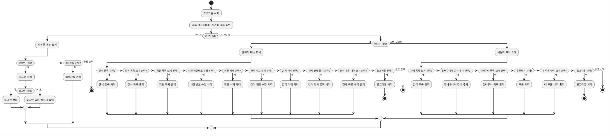

# 간식 쇼핑몰 콘솔 앱

## 프로젝트 개요
간식 쇼핑몰 콘솔 앱은 회원 관리, 간식 관리, 장바구니, 주문 기능을 포함하는 Java 기반 콘솔 애플리케이션입니다.

---

## 다이어그램

### 1. 액티비티 다이어그램

### 2. 유스케이스 다이어그램

### 3. 클래스 다이어그램

---

## 시연 영상

위 이미지를 클릭하면 시연 영상을 볼 수 있습니다.

---

## 주요 기능
- 회원가입 / 로그인 / 로그아웃
- 관리자: 간식 등록, 수정, 삭제, 재고 관리
- 사용자: 간식 목록 조회, 장바구니 추가/조회, 주문 처리 및 주문 내역 조회
- 주문 내역은 사용자별로 관리되며, 관리자는 전체 주문 내역 조회 가능

---

## 폴더 구조
